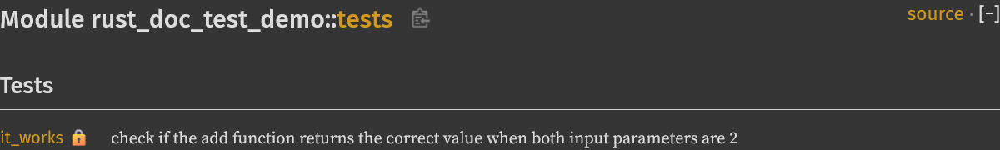
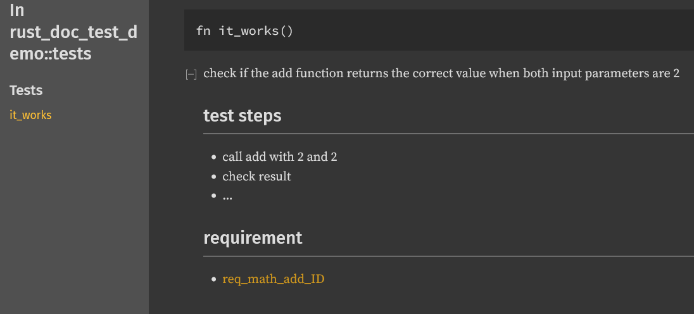

# Presentation of --document-tests

This repository is a demo of the use case for documentation for tests.
Currently we have working proof of concept at https://github.com/Infineon/rust/tree/test_documentation.

see [demo](https://github.com/ifxfrancois/rust_doc_test_demo)

## Summary 

Add an option to rustdoc/cargo doc for including the documentation of the tests in the generated documentation. 

## Motivation

During the development of embedded software, Quality or certifications teams need a quick overview of the tests of a project.
Typical relevant information are what, how and why a test tests.
* What would be a short description of the test.
* How would be a short list of the important tests steps.
* Why would be references to the relevant detailed architecture or requirements documents.

This information can easily be written as markdown in the documentation of a test function but
the current rustdoc/cargo doc excludes all modules and functions marked as `#[test]` for the
generation of the documentation.

Our proposal would be to add a new option to rustdoc/cargo doc which doesn't filter the tests out.
Additionally the test functions would be grouped in a paragraph called "Tests" instead of being
added to the function paragraph.

As a demonstration the generated doc for the demo are under target/doc.

## Guide-level explanation

This proposes the new option `--document-tests` for rustdoc when this option is set:
 * the test modules are not filtered out of the documentation,
 * the test functions are gathered in a category called tests.
 
For cargo the option `--document-tests` should run rustdoc with the option `--document-tests` on the project and on each integration tests and generate a unified documentation.

## Build doc with documentation of tests

* build the rust fork at https://github.com/Infineon/rust/tree/test_documentation
* link the produced toolchain to stage1
* run the command `cargo +stage1  rustdoc -- -Z unstable-options --document-tests --document-private-items`

## Limitation of the POC

### Integration tests

currently intgration tests are not added to the produced documentation.
